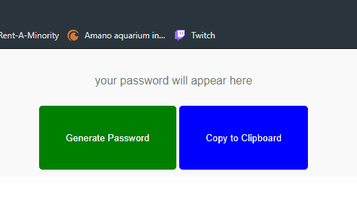

# Password Generator

A simple, local password generator powered by JavaScript.
Because the script is run locally, it is relatively secure...
relatively...

https://jonoaugustine.github.io/pass-gen/index.html

## Application Structure

Upon loading, the page prompts the user to determine the password character
pool (upper/lower case, special characters, & digits) and finally the password
length. After the length is confirmed, the string is generated and
displayed in the input field & the user is able to copy it to clipboard.

When completed successfully, the page looks like this:

If the user does not choose any character type or chooses an invalid
(or out of range) length, an appropriate alert displays the err.
