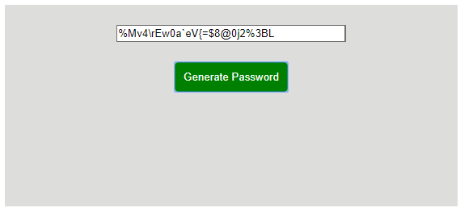

# Password Generator 

A simple, local password generator powered by JavaScript.
Because the script is run locally, it is relatively secure...
relatively...

https://jonoaugustine.github.io/pass-gen/index.html

## Application Structure

Upon loading, the page prompts the user to determine the password character pool and finally the password length.
After the length is confirmed, the string is generated and
displayed in the input field. 

When completed, the page looks like this:

